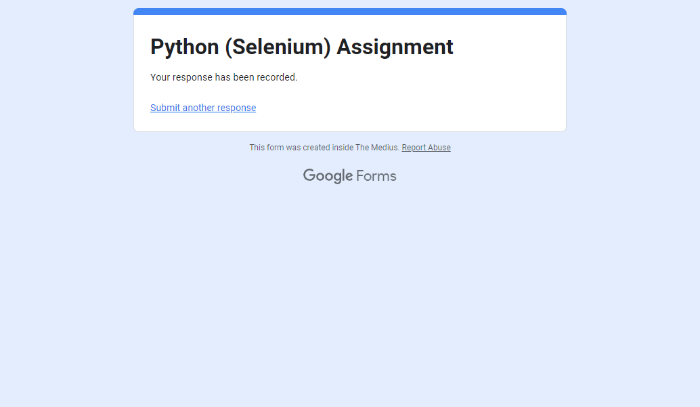
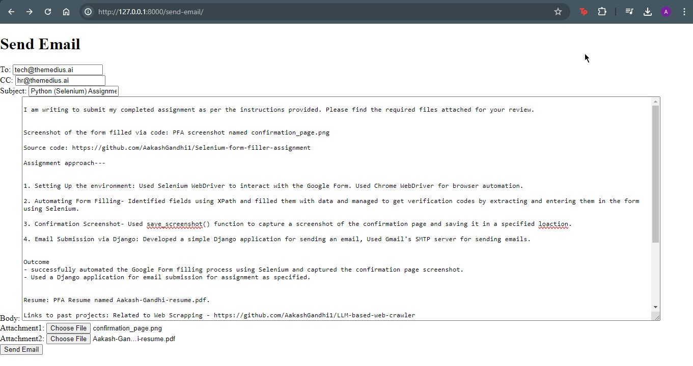
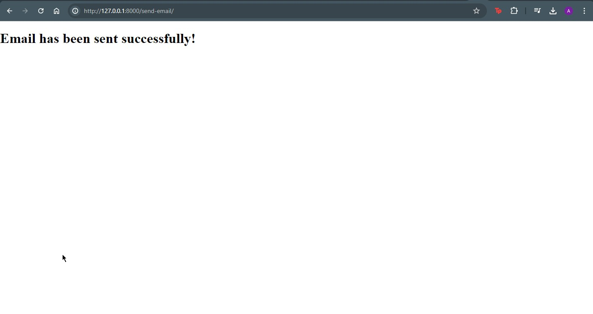

# Selenium-form-filler-assignment
The assignment aimed to automate the process of filling out a Google Form using Selenium, capturing a screenshot of the confirmation page, and submitting the assignment details via email using Django.

# Screenshots

## Form confirmation page - 

## Send Email page - 

## Email sent successfully - 

